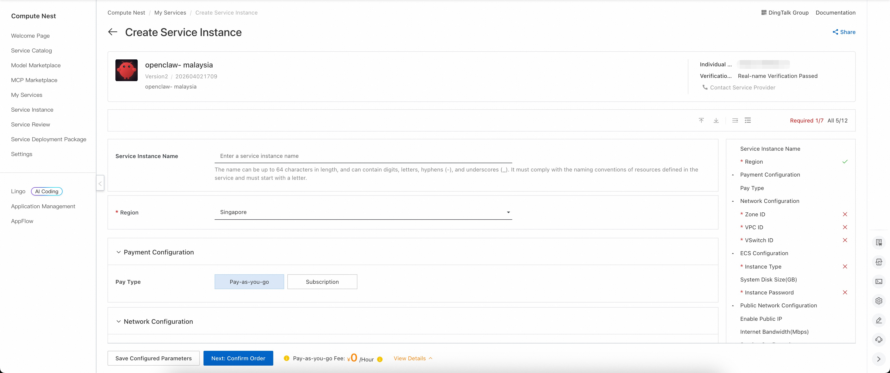
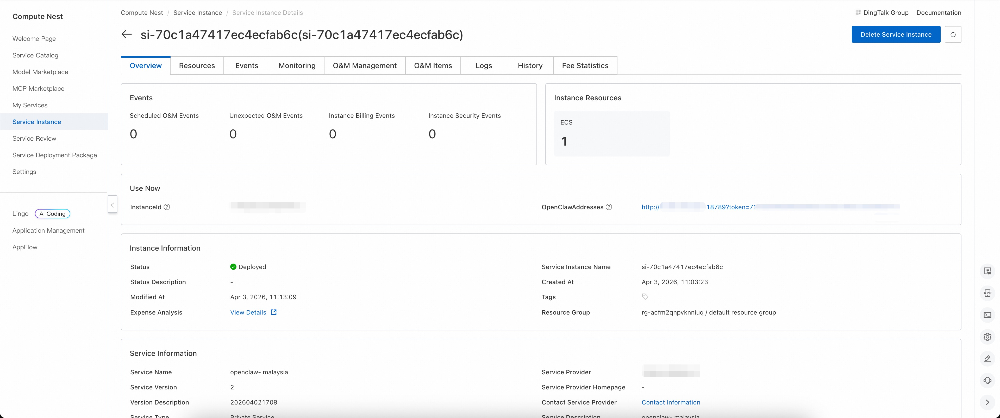
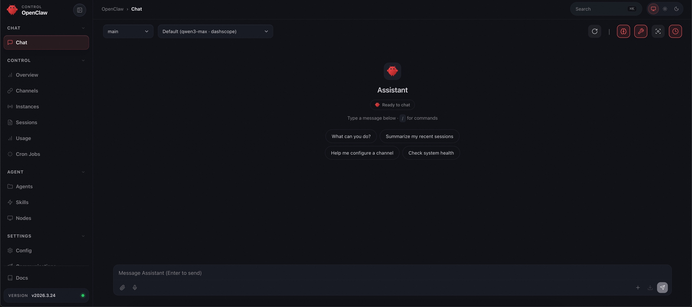

# Openclaw-Malaysia Introduction

Openclaw-Malaysia is a modern robotic process automation (RPA) platform specifically designed for the Malaysian market. Openclaw-Malaysia helps users automate repetitive desktop tasks and increase productivity, with deep localization tailored to Malaysia's unique business environment. Openclaw-Malaysia has an intuitive user interface and powerful automation functions to support a variety of application scenarios. With Openclaw-Malaysia, you can easily create, manage, and execute automated tasks without programming experience. It also provides rich integration interfaces that work seamlessly with other systems and services.

# Deployment process

1. Visit the Openclaw-Malaysia of the computing nest [deployment link](https://computenest.console.aliyun.com/service/instance/create/cn-hangzhou?type=user&ServiceId=service-eaa79a990d5341ee9fb6) and fill in the deployment parameters according to the page prompt:
2. After completing the parameters, you can see the corresponding RFQ details. After confirming the parameters, click **Next: Confirm Order**.
3. Confirm that the order is complete and agree to the service agreement and click **Create Now** to enter the deployment phase.
4. Wait for the deployment to complete and enter the service instance details page.
5. Click on the service address and use the Openclaw-Malaysia community version.