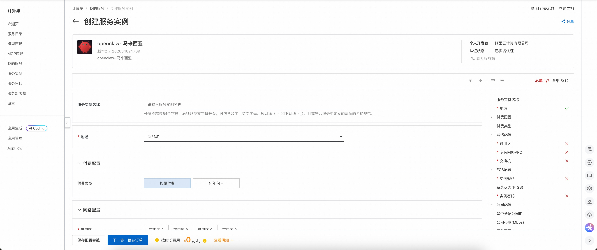
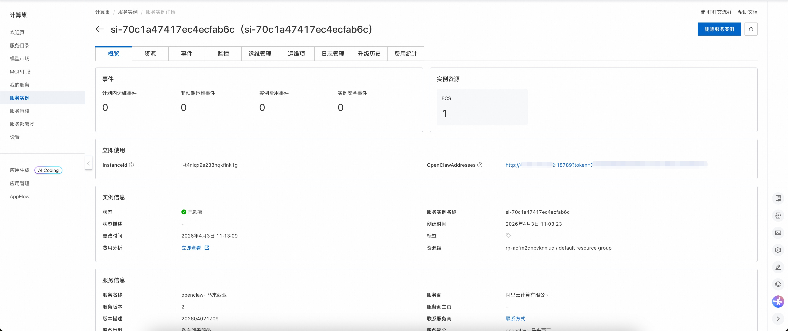
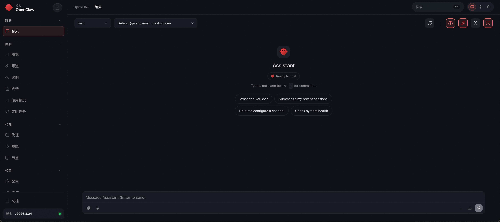

# Openclaw-Malaysia 介绍

Openclaw-Malaysia 是专为马来西亚市场设计的现代机器人流程自动化（RPA）平台。Openclaw-Malaysia 帮助用户自动化重复的桌面任务并提高生产力，针对马来西亚独特的商业环境进行了深度本地化适配。Openclaw-Malaysia 拥有直观的用户界面和强大的自动化功能，支持多种应用场景。使用 Openclaw-Malaysia，您可以轻松创建、管理和执行自动化任务，无需编程经验。它还提供丰富的集成接口，可与其他系统和服务无缝协作。

# 部署流程

1. 访问 Openclaw-Malaysia 计算巢[部署链接](https://computenest.console.aliyun.com/service/instance/create/cn-hangzhou?type=user&ServiceId=service-eaa79a990d5341ee9fb6)，根据页面提示填写部署参数：
2. 完成参数填写后，可以看到对应的询价详情。确认参数无误后，点击**下一步：确认订单**。
3. 确认订单信息完整并同意服务协议后，点击**立即创建**，进入部署阶段。
4. 等待部署完成，进入服务实例详情页。
5. 点击服务地址，即可使用 Openclaw-Malaysia 社区版。